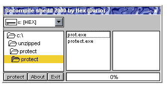



## True Working Decompile Protect Source\!\!\!

### Description

I am submitting my decompile protect forms on planet source because I have seen some poorly coded submissions by other users in an attempt to code a true decompile protector that actually works well look no further my decompile protector protects your executable 3 ways first way by protecting the exe header second by hiding the forms and encrypting them and third removing certain strings that make DoDi's decompiler crash in an attempt to decompile your source... im looking to improve this in any way possible and am open for any feedback hope you all enjoy this source.

-Hex
 
### More Info
 
none all included in ZIP file

             |
---                |---
**Submitted On**   |2000-04-06 11:35:32
**By**             |[Hex](https://github.com/Planet-Source-Code/PSCIndex/blob/master/ByAuthor/hex.md)
**Level**          |Advanced
**User Rating**    |2.8 (53 globes from 19 users)
**Compatibility**  |VB 3\.0, VB 4\.0 \(16\-bit\), VB 4\.0 \(32\-bit\)
**Category**       |[Complete Applications](https://github.com/Planet-Source-Code/PSCIndex/blob/master/ByCategory/complete-applications__1-27.md)
**World**          |[Visual Basic](https://github.com/Planet-Source-Code/PSCIndex/blob/master/ByWorld/visual-basic.md)
**Archive File**   |[CODE\_UPLOAD4586462000\.zip](https://github.com/Planet-Source-Code/hex-true-working-decompile-protect-source__1-7071/archive/master.zip)

### API Declarations

none all included in ZIP file

